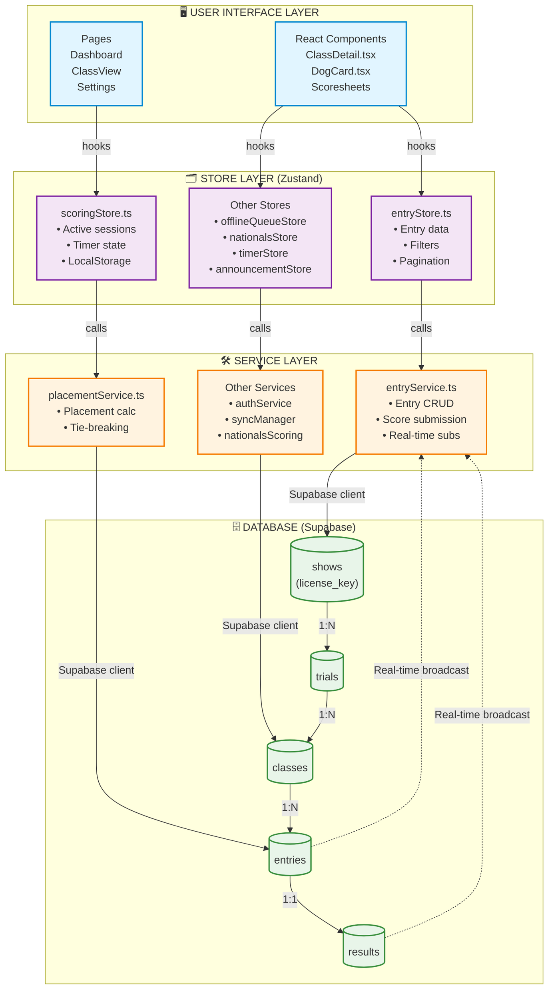
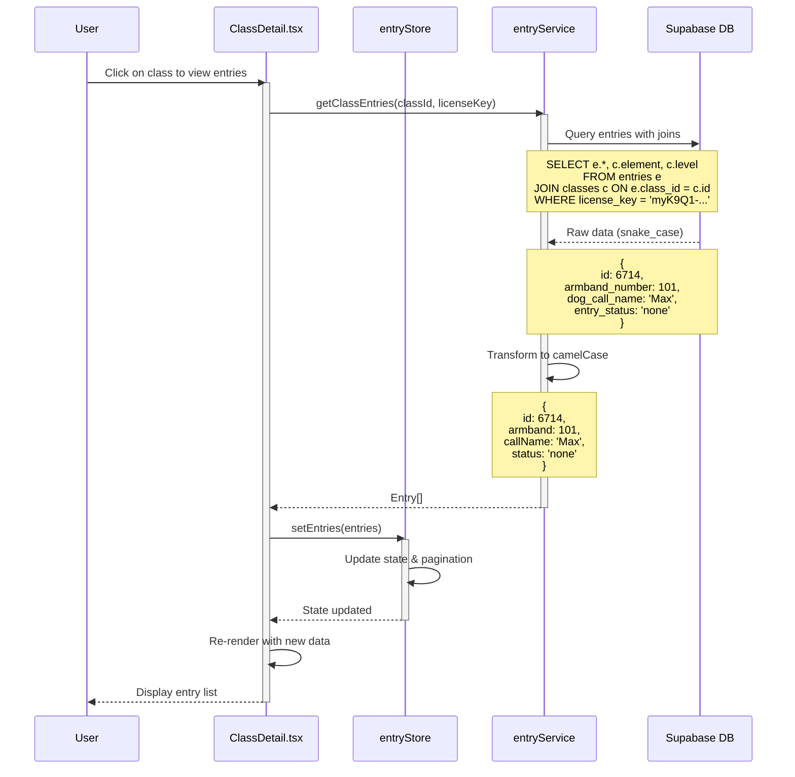
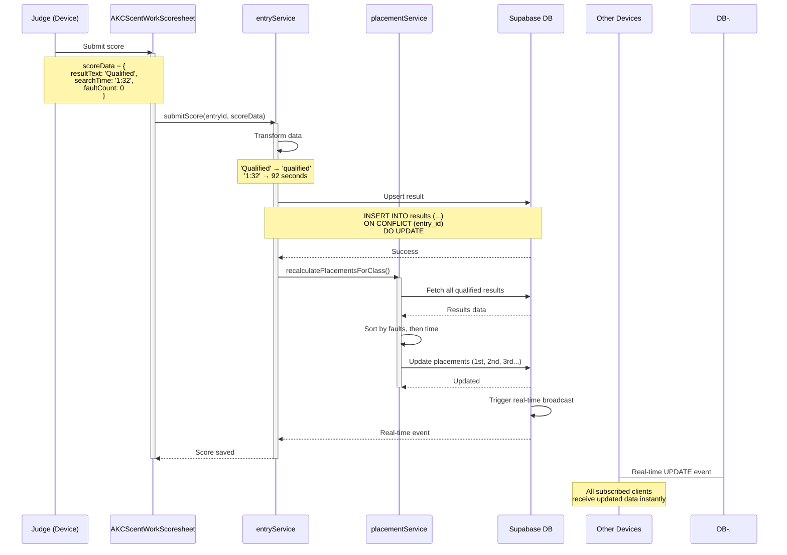
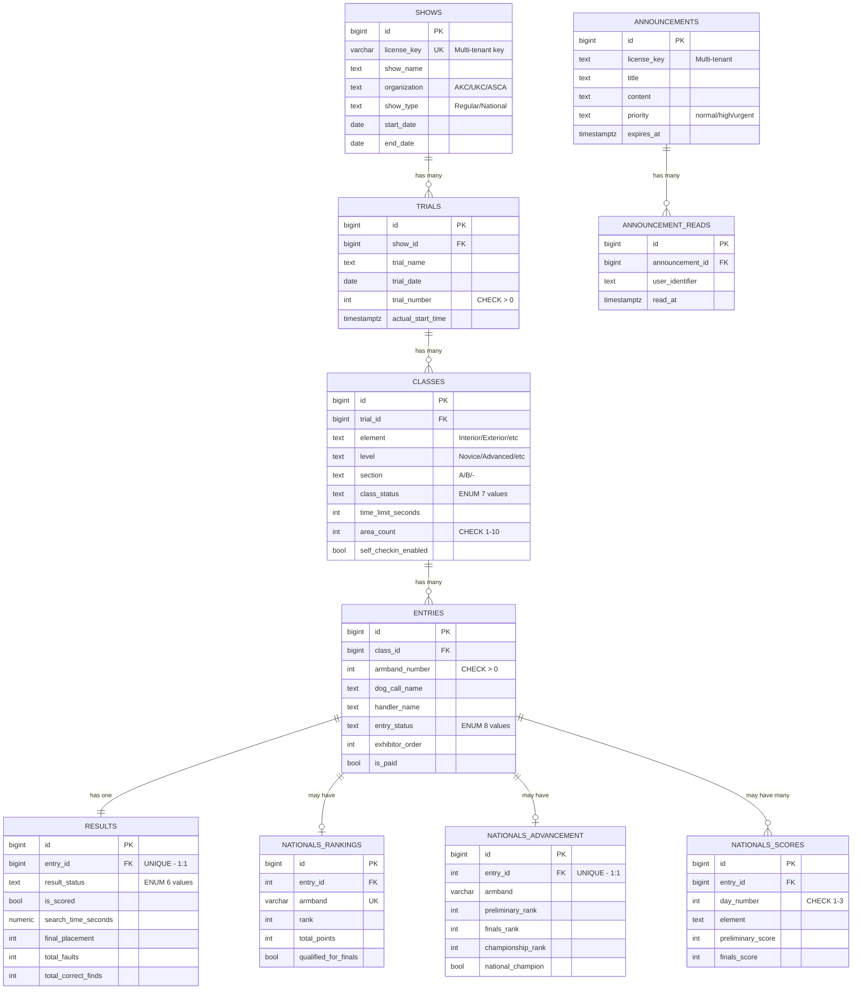
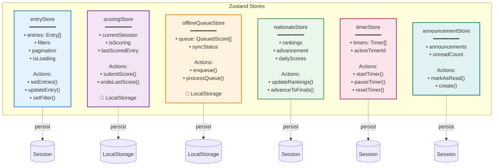
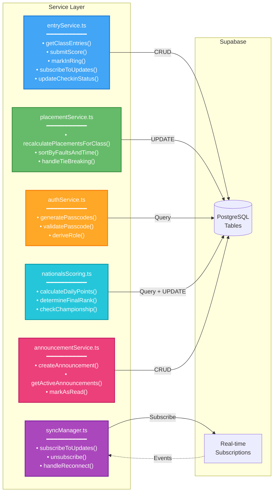
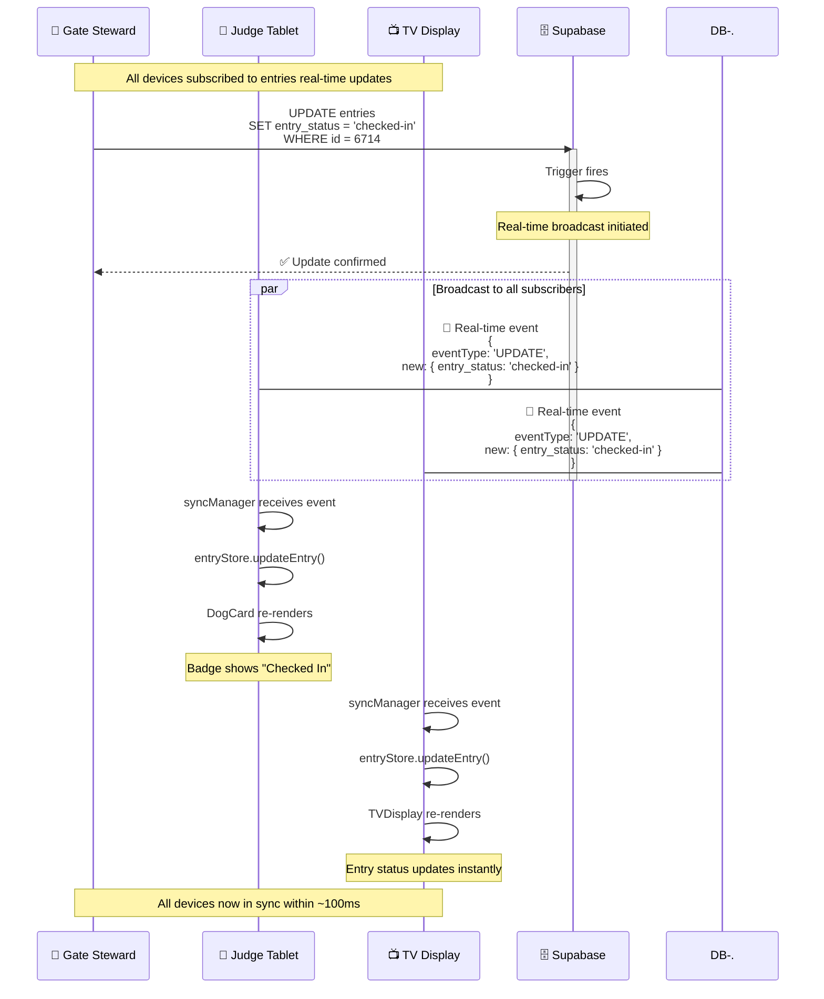
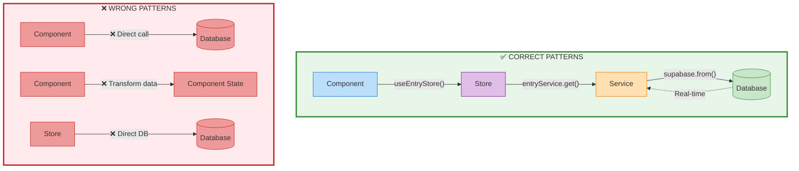

# myK9Q Three-Tier Architecture (Mermaid Diagrams)

**Purpose:** Visual documentation of the data flow through the application's three-tier architecture using interactive Mermaid diagrams.

**Generated:** 2025-10-25

---

## 🏛️ Architectural Overview



---

## 📊 Entry Management Flow



---

## 🎯 Score Submission Flow



---

## 🔄 Real-time Subscription Flow

```mermaid
graph LR
    subgraph DeviceA["📱 Device A (Gate Steward)"]
        A_Component["ExhibitorCheckin.tsx"]
        A_Service["entryService"]
    end

    subgraph Database["🗄️ Supabase"]
        EntriesTable[("entries table")]
        RealtimeTrigger["Real-time Trigger"]
    end

    subgraph DeviceB["📱 Device B (Judge Tablet)"]
        B_Sync["syncManager"]
        B_Store["entryStore"]
        B_Component["ClassDetail.tsx"]
    end

    subgraph DeviceC["📺 Device C (TV Display)"]
        C_Sync["syncManager"]
        C_Store["entryStore"]
        C_Component["TVDisplay.tsx"]
    end

    A_Component -->|updateEntryCheckinStatus| A_Service
    A_Service -->|UPDATE entries| EntriesTable
    EntriesTable -->|Trigger fires| RealtimeTrigger

    RealtimeTrigger -.->|Broadcast event| B_Sync
    RealtimeTrigger -.->|Broadcast event| C_Sync

    B_Sync -->|updateEntry| B_Store
    B_Store -->|Re-render| B_Component

    C_Sync -->|updateEntry| C_Store
    C_Store -->|Re-render| C_Component

    style EntriesTable fill:#4caf50,stroke:#2e7d32,stroke-width:3px,color:#fff
    style RealtimeTrigger fill:#ff9800,stroke:#f57c00,stroke-width:2px,color:#000
    style A_Component fill:#e3f2fd,stroke:#1976d2,stroke-width:2px
    style B_Component fill:#e3f2fd,stroke:#1976d2,stroke-width:2px
    style C_Component fill:#e3f2fd,stroke:#1976d2,stroke-width:2px
```



---

## 🗄️ Database Schema Relationships



---

## 🔄 Data Transformation Pipeline

```mermaid
flowchart LR
    subgraph Read["📖 READ FLOW (DB → UI)"]
        direction TB
        DB_Read[("Database Query<br/>(snake_case)")]
        Service_Read["Service Transform<br/>(camelCase)"]
        Store_Read["Store State<br/>(Entry interface)"]
        UI_Read["UI Render<br/>(React)"]

        DB_Read -->|"armband_number: 101<br/>dog_call_name: 'Max'"| Service_Read
        Service_Read -->|"armband: 101<br/>callName: 'Max'"| Store_Read
        Store_Read -->|Entry object| UI_Read
    end

    subgraph Write["✍️ WRITE FLOW (UI → DB)"]
        direction TB
        UI_Write["Component Submit<br/>(user-friendly)"]
        Service_Write["Service Transform<br/>(DB format)"]
        DB_Write[("Database Insert<br/>(snake_case)")]
        Broadcast["Real-time Broadcast"]

        UI_Write -->|"resultText: 'Qualified'<br/>searchTime: '1:32'"| Service_Write
        Service_Write -->|"result_status: 'qualified'<br/>search_time_seconds: 92"| DB_Write
        DB_Write -->|Trigger fires| Broadcast
    end

    Broadcast -.->|Real-time event| DB_Read

    style DB_Read fill:#4caf50,stroke:#2e7d32,stroke-width:2px,color:#fff
    style DB_Write fill:#4caf50,stroke:#2e7d32,stroke-width:2px,color:#fff
    style Service_Read fill:#ff9800,stroke:#f57c00,stroke-width:2px
    style Service_Write fill:#ff9800,stroke:#f57c00,stroke-width:2px
    style Broadcast fill:#f44336,stroke:#c62828,stroke-width:2px,color:#fff
```



---

## 🏪 Store Architecture



---

## 🛠️ Service Architecture



---

## 📱 Multi-Device Sync Example



---

## 🚨 Architectural Rules Visualization



---

## 📚 How to View These Diagrams

### On GitHub
✅ Mermaid diagrams render automatically in GitHub markdown files!

### In VS Code
1. Install extension: **Markdown Preview Mermaid Support**
2. Open this file and press `Ctrl+Shift+V` (Markdown Preview)

### In IDE (other)
- **IntelliJ/WebStorm**: Built-in Mermaid support
- **Obsidian**: Native rendering
- **Notion**: Copy-paste diagram code

### Online Editor
Visit [Mermaid Live Editor](https://mermaid.live/) to edit and export diagrams.

---

## 🎨 Diagram Types Used

| Diagram Type | Use Case | Syntax |
|--------------|----------|--------|
| **Flowchart** | Architecture overview, data flow | `graph TB` |
| **Sequence** | Time-based interactions, API calls | `sequenceDiagram` |
| **Entity-Relationship** | Database schema | `erDiagram` |

---

## 📝 Editing Tips

**To modify diagrams:**
1. Find the diagram you want to edit
2. Update the text within the ` ```mermaid` code block
3. Preview changes (GitHub renders automatically)
4. Commit the updated markdown file

**Common edits:**
- Add new store: Edit "Store Architecture" diagram
- Add new service: Edit "Service Architecture" diagram
- Add new table: Edit "Database Schema Relationships" diagram

---

## 🔗 Related Documentation

- [DATABASE_REFERENCE.md](./DATABASE_REFERENCE.md) - Views, functions, query patterns
- [TYPE_MAPPING.md](./TYPE_MAPPING.md) - TypeScript ↔ PostgreSQL mappings
- [ARCHITECTURE_DIAGRAM.md](./ARCHITECTURE_DIAGRAM.md) - ASCII version (fallback)
- [README.md](./README.md) - Documentation index

---

**Last Updated:** 2025-10-25
**Format:** Mermaid diagrams (interactive, version-control friendly)
**Compatibility:** GitHub, GitLab, VS Code, IntelliJ, Obsidian, Notion
