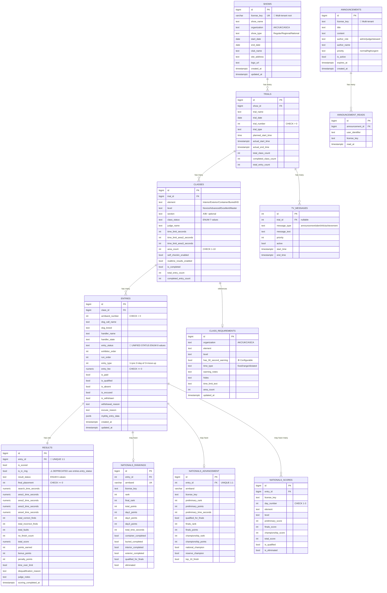

# myK9Q Database Entity Relationship Diagram

**Database:** Supabase (PostgreSQL)
**Project ID:** yyzgjyiqgmjzyhzkqdfx
**Region:** us-east-2
**Generated:** 2025-10-25

---

## 🏗️ Core Schema Overview

This document provides a visual and textual representation of the myK9Q database schema, including all tables, relationships, and key constraints.

---

## 📊 Entity Relationship Diagram

> **💡 Interactive Version Available:** See [ARCHITECTURE_DIAGRAM_MERMAID.md](./ARCHITECTURE_DIAGRAM_MERMAID.md) for interactive Mermaid diagrams that render on GitHub!

### Mermaid ERD (Interactive)



### ASCII ERD (Detailed)

```
┌─────────────────────────────────────────────────────────────────────────────┐
│                         MULTI-TENANT ARCHITECTURE                           │
│                    (license_key isolation at root level)                    │
└─────────────────────────────────────────────────────────────────────────────┘

┌──────────────────────┐
│      SHOWS           │  ◄──── ROOT TENANT CONTAINER
├──────────────────────┤
│ PK: id (bigint)      │
│ UK: license_key      │  ◄──── Multi-tenant isolation key
│                      │
│ show_name            │
│ club_name            │
│ organization         │  (AKC, UKC, ASCA)
│ show_type            │  (Regular, Regional, National)
│ start_date           │
│ end_date             │
│ site_address/city    │
│ secretary_* fields   │
│ chairman_* fields    │
│ logo_url             │
│ app_version          │
└──────────────────────┘
         │
         │ 1:N
         ▼
┌──────────────────────┐
│      TRIALS          │  ◄──── Trial instances within a show
├──────────────────────┤
│ PK: id (bigint)      │
│ FK: show_id          │  ──► shows.id
│                      │
│ trial_name           │
│ trial_date           │
│ trial_number         │  (1, 2, 3... CHECK > 0)
│ trial_type           │
│ planned_start_time   │
│ actual_start_time    │
│ actual_end_time      │
│ total_class_count    │
│ completed_class_count│
│ total_entry_count    │
│ access_trial_id      │  (legacy Access DB compatibility)
└──────────────────────┘
         │
         │ 1:N
         ▼
┌──────────────────────┐
│      CLASSES         │  ◄──── Competition classes
├──────────────────────┤
│ PK: id (bigint)      │
│ FK: trial_id         │  ──► trials.id
│                      │
│ element              │  (Interior, Exterior, Container, Buried, Handler Discrimination)
│ level                │  (Novice, Advanced, Excellent, Master)
│ section              │  (A, B, - optional)
│ class_status         │  (none, setup, briefing, break, start_time, in_progress, completed)
│ judge_name           │
│ class_order          │
│ time_limit_seconds   │  ◄──── Primary time limit
│ time_limit_area2_sec │  ◄──── Multi-area support
│ time_limit_area3_sec │  ◄──── Multi-area support
│ area_count           │  (1-10, CHECK > 0)
│                      │
│ self_checkin_enabled │  ◄──── Exhibitor access control
│ realtime_results_ena │
│ is_completed         │
│                      │
│ *_entry_count fields │  (total, pending, completed, absent, qualified, nq, excused, in_progress)
│ pre_entry_fee        │
│ day_of_show_fee      │
│ access_class_id      │  (legacy Access DB compatibility)
└──────────────────────┘
         │
         │ 1:N
         ▼
┌──────────────────────┐
│      ENTRIES         │  ◄──── Dog entries in classes
├──────────────────────┤
│ PK: id (bigint)      │
│ FK: class_id         │  ──► classes.id
│                      │
│ armband_number       │  (CHECK > 0)
│ handler_name         │
│ dog_call_name        │
│ dog_breed            │
│ entry_status         │  ◄──── UNIFIED STATUS FIELD
│                      │         (none, checked-in, at-gate,
│                      │          come-to-gate, conflict,
│                      │          pulled, in-ring, completed)
│                      │
│ run_order            │
│ exhibitor_order      │  ◄──── Drag-drop reordering
│ entry_type           │  (1=pre_entry, 2=day_of_show, 3=move_up)
│ entry_fee            │
│ is_paid              │
│                      │
│ is_qualified         │
│ is_absent            │
│ is_excused           │
│ is_withdrawn         │
│ has_health_issues    │
│                      │
│ payment_method       │
│ withdrawal_reason    │
│ excuse_reason        │
│ health_timestamp     │
│ health_comment       │
│                      │
│ myk9q_entry_data     │  (JSONB - app-specific data)
│ access_entry_id      │  (legacy Access DB compatibility)
│ handler_state        │
│ handler_location     │
└──────────────────────┘
         │
         │ 1:1
         ▼
┌──────────────────────┐
│      RESULTS         │  ◄──── Scoring results
├──────────────────────┤
│ PK: id (bigint)      │
│ FK: entry_id (UK)    │  ──► entries.id (UNIQUE - 1:1 relationship)
│                      │
│ is_scored            │  ◄──── Completion flag
│ is_in_ring           │  ◄──── Currently competing
│ result_status        │  (pending, qualified, nq, absent, excused, withdrawn)
│                      │
│ search_time_seconds  │  ◄──── Primary time
│ area1_time_seconds   │  ◄──── Multi-area timing
│ area2_time_seconds   │
│ area3_time_seconds   │
│ area4_time_seconds   │
│                      │
│ total_correct_finds  │
│ total_incorrect_finds│
│ total_faults         │
│ no_finish_count      │
│                      │
│ area1_correct        │
│ area1_incorrect      │
│ area1_faults         │
│ (area2/3 similar)    │
│                      │
│ final_placement      │  ◄──── Calculated placement (1st, 2nd, 3rd...)
│ total_score          │
│ points_earned        │
│ points_possible      │
│ bonus_points         │
│ penalty_points       │
│                      │
│ time_over_limit      │
│ time_limit_exceeded  │
│                      │
│ disqualification_rsn │
│ judge_notes          │
│ video_review_notes   │
│ judge_signature      │
│                      │
│ ring_entry_time      │
│ ring_exit_time       │
│ scoring_started_at   │
│ scoring_completed_at │
└──────────────────────┘


┌─────────────────────────────────────────────────────────────────────────────┐
│                         SUPPORTING TABLES                                   │
└─────────────────────────────────────────────────────────────────────────────┘

┌──────────────────────┐
│ CLASS_REQUIREMENTS   │  ◄──── Organization-specific class rules
├──────────────────────┤
│ PK: id (bigint)      │
│                      │
│ organization         │  (AKC, UKC, ASCA)
│ element              │
│ level                │
│                      │
│ has_30_second_warn   │  ◄──── Configurable timer warning
│ time_type            │  (fixed, range, dictated)
│ warning_notes        │  ◄──── Custom warning text
│                      │
│ hides                │  (text description)
│ distractions         │
│ height               │
│ time_limit_text      │
│ area_size            │
│ required_calls       │
│ final_response       │
│ containers_items     │
│ area_count           │
│                      │
│ updated_at           │  ◄──── Trigger updates this
└──────────────────────┘

┌──────────────────────┐
│   NATIONALS_RANKINGS │  ◄──── Nationals-specific scoring
├──────────────────────┤
│ PK: id (bigint)      │
│ FK: entry_id         │  ──► entries.id
│ UK: armband          │
│                      │
│ license_key          │  ◄──── Multi-tenant isolation
│                      │
│ rank                 │
│ final_rank           │
│ total_points         │
│ day1/2/3_points      │
│ total_time_seconds   │
│ day1/2/3_time_sec    │
│                      │
│ container_completed  │
│ buried_completed     │
│ interior_completed   │
│ exterior_completed   │
│ hd_challenge_compl   │
│                      │
│ qualified_for_finals │
│ eliminated           │
│ withdrawal           │
└──────────────────────┘

┌──────────────────────┐
│NATIONALS_ADVANCEMENT │  ◄──── Nationals progression tracking
├──────────────────────┤
│ PK: id (bigint)      │
│ FK: entry_id (UK)    │  ──► entries.id
│                      │
│ armband              │
│ license_key          │
│                      │
│ preliminary_rank     │
│ preliminary_points   │
│ preliminary_time_sec │
│                      │
│ qualified_for_finals │
│                      │
│ finals_rank          │
│ finals_points        │
│ finals_time_seconds  │
│                      │
│ championship_rank    │
│ championship_points  │
│                      │
│ national_champion    │
│ reserve_champion     │
│ top_10_finish        │
│                      │
│ qualification_date   │
└──────────────────────┘

┌──────────────────────┐
│   NATIONALS_SCORES   │  ◄──── Daily element scoring
├──────────────────────┤
│ PK: id (bigint)      │
│ FK: entry_id         │  ──► entries.id
│                      │
│ license_key          │
│ day_number           │  (1-3, CHECK >= 1 AND <= 3)
│ element              │
│ level                │
│                      │
│ preliminary_score    │
│ finals_score         │
│ championship_score   │
│ total_score          │
│                      │
│ is_qualified         │
│ is_eliminated        │
└──────────────────────┘

┌──────────────────────┐
│    ANNOUNCEMENTS     │  ◄──── Push notifications system
├──────────────────────┤
│ PK: id (bigint)      │
│                      │
│ license_key          │  ◄──── Multi-tenant isolation
│ title                │
│ content              │
│ author_role          │  (admin, judge, steward)
│ author_name          │
│ priority             │  (normal, high, urgent)
│ is_active            │
│ expires_at           │
└──────────────────────┘
         │
         │ 1:N
         ▼
┌──────────────────────┐
│ ANNOUNCEMENT_READS   │  ◄──── Read tracking
├──────────────────────┤
│ PK: id (bigint)      │
│ FK: announcement_id  │  ──► announcements.id
│                      │
│ user_identifier      │
│ license_key          │
│ read_at              │
└──────────────────────┘

┌──────────────────────┐
│   JUDGE_PROFILES     │  ◄──── Judge information
├──────────────────────┤
│ PK: id (int)         │
│                      │
│ name                 │
│ photo_url            │
│ judging_since        │
│ home_state           │
│ specialties          │  (ARRAY)
│ fun_facts            │  (ARRAY)
│ akc_number           │
│ bio_text             │
│ day_assignments      │  (JSONB)
└──────────────────────┘

┌──────────────────────┐
│    TV_MESSAGES       │  ◄──── TV display system
├──────────────────────┤
│ PK: id (int)         │
│ FK: trial_id         │  ──► trials.id (nullable)
│                      │
│ message_type         │  (announcement, alert, info, achievement)
│ message_text         │
│ priority             │
│ active               │
│ start_time           │
│ end_time             │
└──────────────────────┘

┌──────────────────────┐
│  EVENT_STATISTICS    │  ◄──── Event metrics
├──────────────────────┤
│ PK: id (int)         │
│ FK: trial_id         │  (nullable)
│                      │
│ event_date           │
│ statistic_type       │
│ statistic_key        │
│ statistic_value      │  (JSONB)
└──────────────────────┘

```

---

## 🔑 Key Relationships

### 1. **Multi-Tenant Hierarchy** (1:N cascade)
```
shows (license_key)
  └─► trials (show_id)
      └─► classes (trial_id)
          └─► entries (class_id)
              └─► results (entry_id) [1:1]
```

### 2. **Nationals Tracking** (Optional 1:N)
```
entries
  ├─► nationals_rankings (entry_id)
  ├─► nationals_advancement (entry_id) [1:1]
  └─► nationals_scores (entry_id) [1:N per day/element]
```

### 3. **Reference Data** (No FK, queried by org/element/level)
```
class_requirements
  ─► Queried by: (organization, element, level)
  ─► Used to configure class rules dynamically
```

### 4. **Announcement System** (1:N)
```
announcements (license_key)
  └─► announcement_reads (announcement_id)
```

---

## 🛡️ Row-Level Security (RLS)

**RLS Enabled Tables:**
- ✅ `shows`
- ✅ `trials`
- ✅ `classes`
- ✅ `entries`
- ✅ `results`
- ✅ `announcements`
- ✅ `announcement_reads`

**No RLS:**
- `class_requirements` (reference data)
- `judge_profiles` (shared data)
- `tv_messages` (public display)
- `event_statistics` (analytics)
- `nationals_*` tables (currently no RLS)

---

## 🔒 Key Constraints

### Check Constraints
| Table | Column | Constraint |
|-------|--------|------------|
| `trials` | `trial_number` | `> 0` |
| `classes` | `area_count` | `> 0 AND <= 10` |
| `classes` | `class_status` | ENUM check (7 values) |
| `entries` | `armband_number` | `> 0` |
| `entries` | `entry_type` | `>= 1 AND <= 3` |
| `entries` | `entry_fee` | `>= 0` |
| `entries` | `entry_status` | ENUM check (8 values) |
| `results` | `final_placement` | `>= 0` |
| `results` | `result_status` | ENUM check (6 values) |
| `class_requirements` | `organization` | `IN ('AKC', 'UKC', 'ASCA')` |
| `class_requirements` | `time_type` | `IN ('fixed', 'range', 'dictated')` |
| `nationals_scores` | `day_number` | `>= 1 AND <= 3` |

### Unique Constraints
| Table | Column | Purpose |
|-------|--------|---------|
| `shows` | `license_key` | Multi-tenant root isolation |
| `entries` | `entry_id` (results FK) | Ensures 1:1 entry-result relationship |
| `nationals_rankings` | `armband` | Unique armband per nationals |
| `nationals_advancement` | `entry_id` | 1:1 advancement tracking |

---

## 📈 Index Strategy

**Composite Indexes for Real-time Queries:**
- `(license_key, class_id)` on entries (added in migration 001)
- `(class_id, armband_number)` for quick armband lookups
- `(entry_id)` on results for 1:1 joins

**Foreign Key Indexes:**
- `trial_id` on classes
- `class_id` on entries
- `entry_id` on results
- All FK columns have implicit indexes

---

## 🔄 Real-time Triggers

**Tables with Real-time Support:**
- `entries` - Check-in status, in-ring status updates
- `results` - Score submissions, placement updates
- `classes` - Class status changes
- `announcements` - Push notifications

**Migration:** `003_add_realtime_triggers`

---

## 📝 Migration History

**Total Migrations:** 85+ (as of 2025-10-25)

**Key Milestones:**
- `001-003`: Initial real-time setup
- `004-008`: Normalized schema creation
- `009-027`: Bidirectional sync (legacy Access DB)
- `010_add_placement_to_results`: Placement calculation
- `013_add_class_rule_configuration`: Configurable class rules
- `014-016_fix_time_limits`: Time limit standardization
- `add_come_to_gate_status`: New entry status
- `consolidate_entry_status`: Unified status field

---

## 🎯 Design Patterns

### 1. **Multi-Tenant Isolation**
- `license_key` field at `shows` table propagates down hierarchy
- All queries MUST filter by `license_key` for data isolation
- RLS policies enforce tenant boundaries

### 2. **Status Field Consolidation**
- `entries.entry_status` - Single source of truth (8 states)
- Replaced: `check_in_status`, `check_in_status_text`, `in_ring`
- `results.is_in_ring` - Deprecated, status now in entries

### 3. **Configurable Class Rules**
- `class_requirements` table stores org-specific rules
- Components check DB first, fall back to hardcoded logic
- Example: `has_30_second_warning`, `time_type`

### 4. **1:1 Entry-Result Relationship**
- Each entry has exactly one result record (or none)
- `entry_id` is UNIQUE in results table
- Scoring data lives in results, not entries

### 5. **Multi-Area Timing**
- Up to 4 area time fields in results
- `area_count` in classes defines how many areas
- Total time calculated as sum of applicable areas

### 6. **Nationals Detection**
- `shows.show_type` contains "National"
- Specialized tables: `nationals_rankings`, `nationals_advancement`, `nationals_scores`
- Different scoring logic via services

---

## 🚨 Critical Notes

### **NEVER use legacy table names:**
- ❌ `tbl_dog_shows` → ✅ `shows`
- ❌ `tbl_trial_events` → ✅ `trials`
- ❌ `tbl_competition_classes` → ✅ `classes`
- ❌ `tbl_class_entries` → ✅ `entries`
- ❌ `tbl_entry_results` → ✅ `results`

### **Always filter by license_key:**
```sql
-- ✅ CORRECT
SELECT * FROM entries e
JOIN classes c ON e.class_id = c.id
JOIN trials t ON c.trial_id = t.id
JOIN shows s ON t.show_id = s.id
WHERE s.license_key = 'myK9Q1-...'

-- ❌ INCORRECT (security vulnerability!)
SELECT * FROM entries WHERE class_id = 275
```

### **Status Field Usage:**
```typescript
// ✅ CORRECT (use unified field)
entry.status === 'in-ring'

// ❌ DEPRECATED (backward compatibility only)
entry.inRing === true
entry.checkinStatus === 'in-ring'
```

---

## 📚 Related Documentation

- [TypeScript-Database Type Mapping](./TYPE_MAPPING.md)
- [Three-Tier Architecture Diagram](./ARCHITECTURE_DIAGRAM.md)
- [CLAUDE.md](../CLAUDE.md) - Development guide
- [Supabase Migrations](../supabase/migrations/) - Schema evolution

---

**Last Updated:** 2025-10-25
**Schema Version:** Derived from migration `consolidate_entry_status` (latest)
