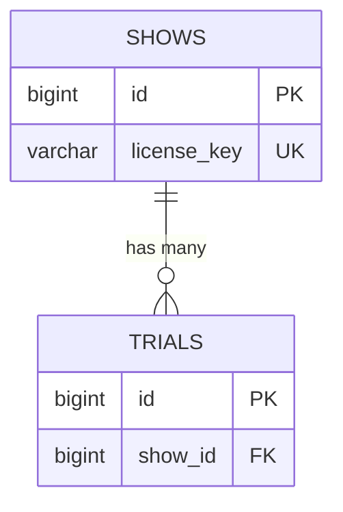
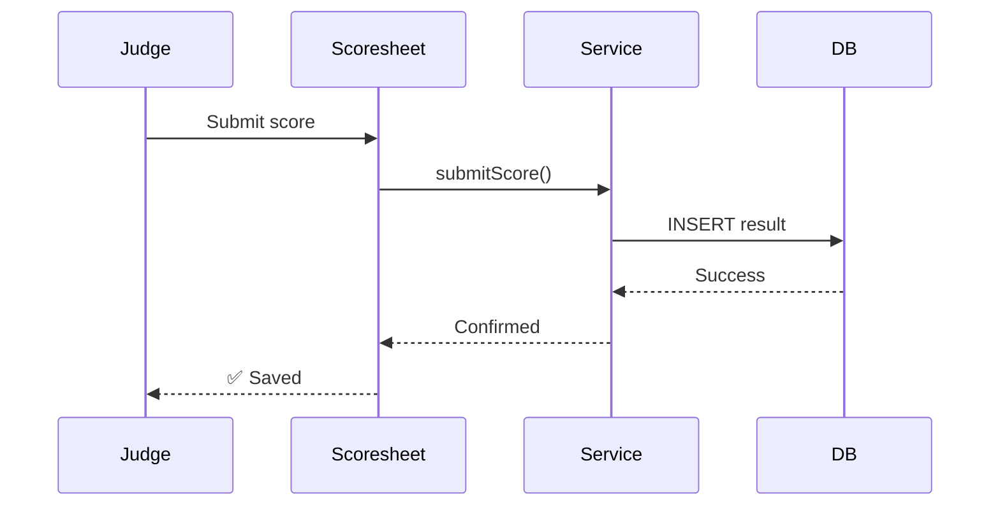
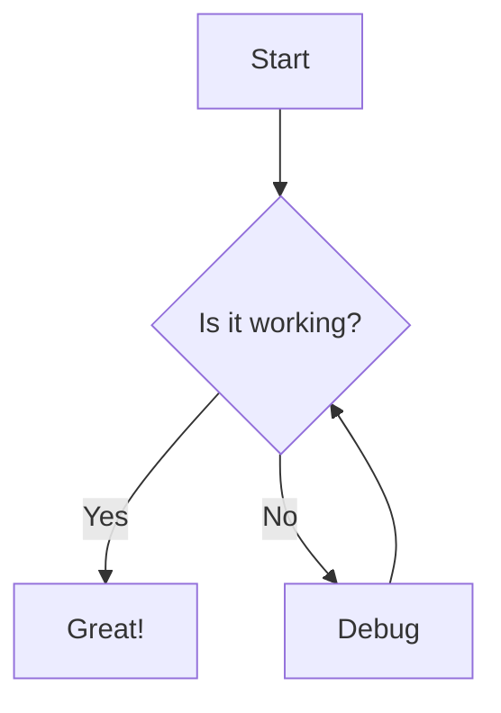
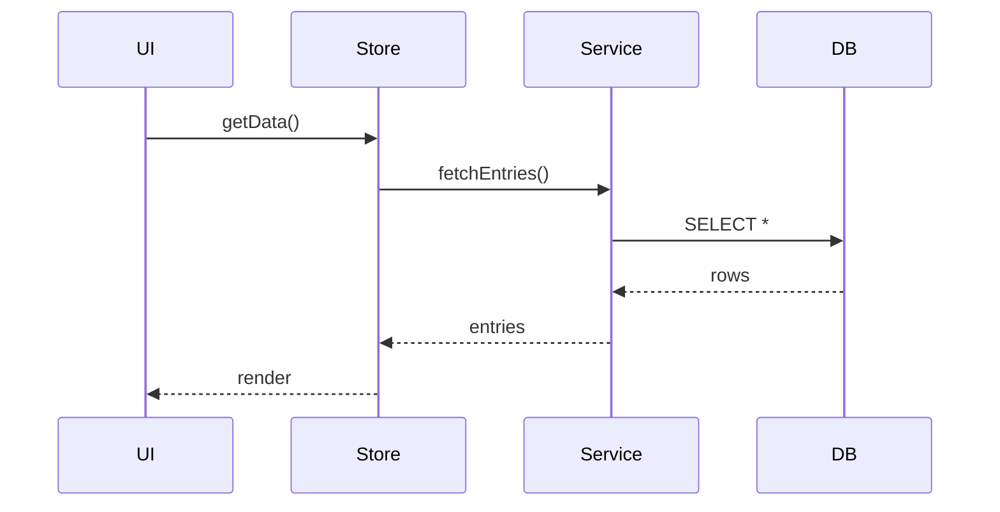
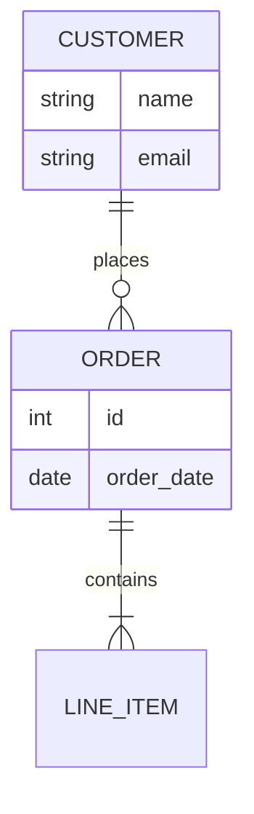
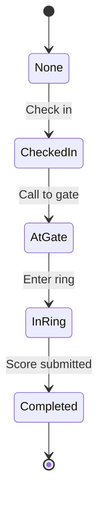
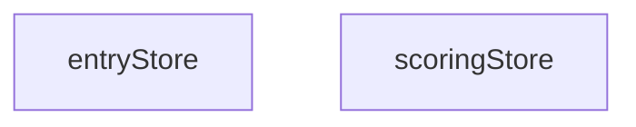
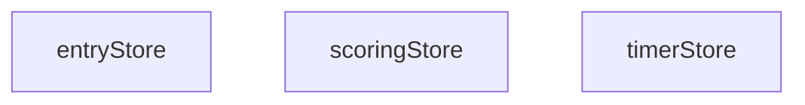
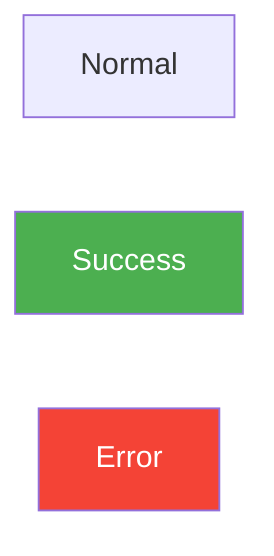
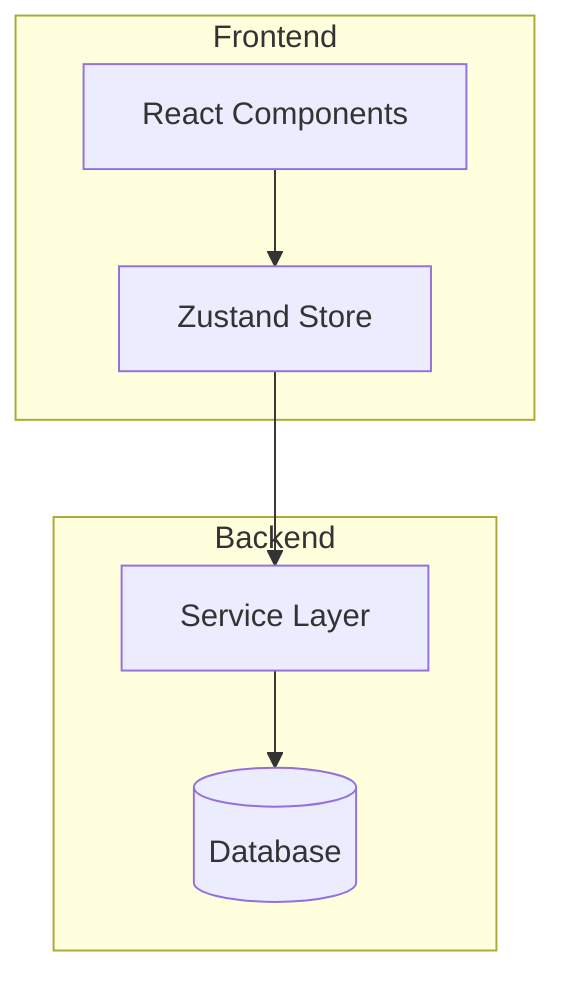

# Mermaid Diagrams Guide

## 🎨 What are Mermaid Diagrams?

**Mermaid** is a JavaScript-based diagramming and charting tool that uses text to create diagrams. Think of it as "Markdown for diagrams."

### Key Benefits

✅ **Version control friendly** - Plain text, not binary images
✅ **Auto-rendered on GitHub** - No plugins needed, renders automatically
✅ **Easy to edit** - Just edit text, diagrams update automatically
✅ **Interactive** - Clickable, zoomable in some viewers
✅ **Consistent styling** - Automatic color schemes and layouts
✅ **No special tools** - Any text editor works

---

## 📊 Comparison: ASCII vs Mermaid

### ASCII Diagrams (What we had before)

```
┌──────────────────────┐
│      SHOWS           │  ◄──── ROOT TENANT CONTAINER
├──────────────────────┤
│ PK: id (bigint)      │
│ UK: license_key      │
└──────────────────────┘
         │
         │ 1:N
         ▼
┌──────────────────────┐
│      TRIALS          │
└──────────────────────┘
```

**Pros:**
- Works everywhere (even plain text files)
- Total control over layout
- No rendering required

**Cons:**
- ❌ Hard to maintain (manual box drawing)
- ❌ Time-consuming to update
- ❌ Not interactive
- ❌ Alignment breaks easily
- ❌ Difficult to make changes

---

### Mermaid Diagrams (What we have now!)



**Pros:**
- ✅ Auto-rendered on GitHub, GitLab, VS Code
- ✅ Easy to update (just edit text)
- ✅ Automatic layout and styling
- ✅ Interactive (clickable nodes)
- ✅ Version control friendly
- ✅ Professional appearance

**Cons:**
- Requires viewer that supports Mermaid (GitHub, VS Code, etc.)
- Less control over exact positioning

---

## 🎯 Example: Score Submission Flow

### Old Way (ASCII)
```
┌────────────────┐
│  Judge clicks  │
│  Submit        │
└────────────────┘
        │
        ▼
┌────────────────┐
│  Scoresheet    │
│  validates     │
└────────────────┘
        │
        ▼
┌────────────────┐
│  Service       │
│  transforms    │
└────────────────┘
```

### New Way (Mermaid)


**See the difference?** Mermaid automatically:
- Draws sequence arrows
- Aligns participants
- Adds proper spacing
- Uses professional styling

---

## 📚 Diagram Types Available

### 1. Flowcharts
**Use for:** Architecture, decision trees, process flows



**Code:**
```
graph TB
    A[Start] --> B{Is it working?}
    B -->|Yes| C[Great!]
    B -->|No| D[Debug]
    D --> B
```

---

### 2. Sequence Diagrams
**Use for:** API calls, time-based interactions, multi-device sync



**Code:**
```
sequenceDiagram
    participant UI
    participant Store
    participant Service
    participant DB

    UI->>Store: getData()
    Store->>Service: fetchEntries()
    Service->>DB: SELECT *
    DB-->>Service: rows
    Service-->>Store: entries
    Store-->>UI: render
```

---

### 3. Entity Relationship Diagrams
**Use for:** Database schemas, table relationships



**Code:**
```
erDiagram
    CUSTOMER ||--o{ ORDER : places
    ORDER ||--|{ LINE_ITEM : contains
    CUSTOMER {
        string name
        string email
    }
```

---

### 4. State Diagrams
**Use for:** Entry status flow, class status transitions



**Code:**
```
stateDiagram-v2
    [*] --> None
    None --> CheckedIn: Check in
    CheckedIn --> AtGate: Call to gate
    AtGate --> InRing: Enter ring
    InRing --> Completed: Score submitted
    Completed --> [*]
```

---

## 🛠️ How to View Mermaid Diagrams

### ✅ On GitHub (Best!)
Just open the markdown file - Mermaid renders automatically!

**Example:** View [ARCHITECTURE_DIAGRAM_MERMAID.md](./ARCHITECTURE_DIAGRAM_MERMAID.md) on GitHub

---

### ✅ VS Code
1. Install extension: **Markdown Preview Mermaid Support**
2. Open any `.md` file with Mermaid diagrams
3. Press `Ctrl+Shift+V` for preview

**Extension link:** https://marketplace.visualstudio.com/items?itemName=bierner.markdown-mermaid

---

### ✅ IntelliJ/WebStorm
Built-in support! Just open the markdown file and click preview.

---

### ✅ Online Editor
Visit [Mermaid Live Editor](https://mermaid.live/) to:
- Edit diagrams in real-time
- Export as PNG/SVG
- Share via URL

---

## ✏️ How to Edit Mermaid Diagrams

### Example: Add a new store to the architecture

**Before:**


**After (add timerStore):**


**Just add one line!** The layout updates automatically.

---

## 🎨 Styling Tips

### Add colors to nodes


### Use subgraphs for grouping


---

## 📖 Common Syntax Reference

### Flowchart Shapes
```
A[Rectangle]
B(Rounded)
C{Diamond}
D((Circle))
E>Flag]
```

### Arrows
```
A --> B   (solid arrow)
A -.-> B  (dotted arrow)
A ==> B   (thick arrow)
A --text--> B  (labeled arrow)
```

### Sequence Diagram
```
A->>B   (solid arrow)
A-->>B  (dotted arrow, response)
A-)B    (async arrow)
```

### ERD Relationships
```
||--||  (one to one)
||--o{  (one to many)
}o--o{  (many to many)
```

---

## 🚀 Quick Start: Create Your First Diagram

1. **Create a new markdown file** (e.g., `my-diagram.md`)

2. **Add this code:**
   ````markdown
   # My First Mermaid Diagram

   ```mermaid
   graph LR
       A[Start] --> B[Process]
       B --> C[End]
   ```
   ````

3. **View on GitHub** or in VS Code preview

4. **It works!** You now have an interactive diagram.

---

## 📚 myK9Q Diagrams Documentation

We've created comprehensive Mermaid diagrams for:

### [ARCHITECTURE_DIAGRAM_MERMAID.md](./ARCHITECTURE_DIAGRAM_MERMAID.md)
- ✅ Architectural overview (3-tier)
- ✅ Entry management flow (sequence)
- ✅ Score submission flow (sequence)
- ✅ Real-time sync (sequence)
- ✅ Database schema (ERD)
- ✅ Store architecture (graph)
- ✅ Service architecture (graph)
- ✅ Multi-device sync (sequence)

### [DATABASE_REFERENCE.md](./DATABASE_REFERENCE.md)
- ✅ Database views and functions
- ✅ Query patterns and multi-tenant isolation
- ✅ Triggers and audit logging

---

## 🎓 Learning Resources

- **Official Docs:** https://mermaid.js.org/
- **Live Editor:** https://mermaid.live/
- **Tutorial:** https://mermaid.js.org/intro/
- **Syntax Cheat Sheet:** https://jojozhuang.github.io/tutorial/mermaid-cheat-sheet/

---

## 🤔 When to Use ASCII vs Mermaid

### Use ASCII when:
- Very simple diagrams (2-3 boxes)
- Need to work in plain text files only
- Exact positioning is critical
- Diagram won't change often

### Use Mermaid when:
- Diagram will be viewed on GitHub/GitLab
- Need to update frequently
- Want professional appearance
- Diagram is complex (5+ nodes)
- **Most of the time! 🎉**

---

## 💡 Pro Tips

1. **Start simple** - Don't try to add all features at once
2. **Use Live Editor** - Preview changes in real-time at mermaid.live
3. **Copy examples** - Our ARCHITECTURE_DIAGRAM_MERMAID.md has great templates
4. **Version control** - Commit diagrams just like code
5. **Keep it readable** - Use proper indentation in the code

---

## 🎉 Summary

**Mermaid diagrams are:**
- ✅ Easy to create and maintain
- ✅ Version control friendly
- ✅ Auto-rendered on GitHub
- ✅ Professional looking
- ✅ Perfect for technical documentation

**You now have:**
- Complete Mermaid versions of all architecture diagrams
- Interactive ERD for database schema
- Easy-to-update visual documentation

**Next steps:**
1. View [ARCHITECTURE_DIAGRAM_MERMAID.md](./ARCHITECTURE_DIAGRAM_MERMAID.md) on GitHub
2. Install VS Code extension for local preview
3. Try editing a diagram yourself!

---

**Created:** 2025-10-25
**Format:** Mermaid.js
**Compatibility:** GitHub, GitLab, VS Code, IntelliJ, Obsidian
