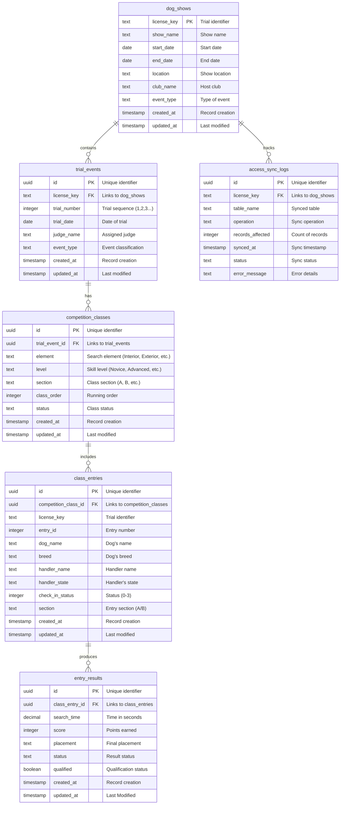

# Normalized Database Relationships - myK9Show

## Entity Relationship Diagram



## Table Relationships Explained

### 1. **dog_shows** (Root Entity)
- **Primary Key**: `license_key` (text)
- **Purpose**: Main container for each dog show event
- **Relationships**:
  - One show can have multiple trial events
  - Tracks sync operations via access_sync_logs

### 2. **trial_events** (Event Container)
- **Primary Key**: `id` (uuid)
- **Foreign Key**: `license_key` → dog_shows
- **Purpose**: Individual trial sessions within a show
- **Relationships**:
  - Each trial belongs to one show
  - Each trial can have multiple competition classes

### 3. **competition_classes** (Class Definition)
- **Primary Key**: `id` (uuid)
- **Foreign Key**: `trial_event_id` → trial_events
- **Purpose**: Specific competition categories (element + level + section)
- **Key Feature**: **Section Merging Logic**
  - Novice A & B sections are merged in UI for unified scoring
  - Section data preserved for separate placement calculations
- **Relationships**:
  - Each class belongs to one trial event
  - Each class can have multiple entries

### 4. **class_entries** (Participant Records)
- **Primary Key**: `id` (uuid)
- **Foreign Key**: `competition_class_id` → competition_classes
- **Purpose**: Individual dog/handler combinations in each class
- **Key Fields**:
  - `section`: Preserved for placement calculations (A/B)
  - `check_in_status`: 0=Not arrived, 1=Checked in, 2=In ring, 3=Complete
- **Relationships**:
  - Each entry belongs to one competition class
  - Each entry can have multiple results (retries/re-runs)

### 5. **entry_results** (Scoring Data)
- **Primary Key**: `id` (uuid)
- **Foreign Key**: `class_entry_id` → class_entries
- **Purpose**: Actual performance results and scores
- **Key Fields**:
  - `search_time`: Performance time in seconds
  - `placement`: Final ranking within section
  - `qualified`: Whether the run qualifies for titles
- **Relationships**:
  - Each result belongs to one class entry
  - Multiple results possible per entry (re-runs)

### 6. **access_sync_logs** (Audit Trail)
- **Primary Key**: `id` (uuid)
- **Foreign Key**: `license_key` → dog_shows
- **Purpose**: Track synchronization between Access and Supabase
- **Relationships**:
  - Links to shows for audit purposes
  - Independent tracking table

## Data Flow & Section Merging

### Original Access Structure (Flat)
```
tbl_entry_queue: All entries in single table
├── Novice A entries (section = 'A')
├── Novice B entries (section = 'B')
└── Other level entries
```

### Normalized Structure (Relational)
```
dog_shows
└── trial_events
    └── competition_classes
        ├── Novice A class (section = 'A')
        ├── Novice B class (section = 'B')
        └── class_entries (preserves original section)
            └── entry_results (placement within section)
```

### UI Merging Logic
- **Scoring Interface**: Combines Novice A + B entries into single list
- **Placement Calculation**: Maintains separate A/B section rankings
- **Real-time Updates**: WebSocket subscriptions work across merged sections

## Current Status
- **Total Entries**: 522/524 synced (99.6% complete)
- **Missing**: 2 entries with data issues
- **Section Merging**: Active for Novice level classes
- **Sync Direction**: Bidirectional (Access ↔ Supabase)

This normalized structure maintains data integrity while enabling the flexible UI requirements for section merging in competition scoring.